# Final Project Proposal

**GitHub Repo URL**: https://github.com/CMU-IDS-Assignments/ids-s26-final-project-megaknight/

**Team Members**: Nihar Atri, Hou Kin Wan, Andrew Zhang, Natan Zmudzinski

## Project Overview

Clash Royale is a competitive mobile card game developed by Supercell where players construct 8 card decks and battle in real time across a global ranked ladder. The game lets players choose from 100+ unique cards, where each card offers different roles in combat. The developers of the game Supercell regularly release balance patches to maintain competitive fairness. Given these factors, building balanced decks that on average perform well is a difficult task to understand without a technical solution.

### Datasets

**Primary Dataset**: Clash Royale Season 18 Ladder Dataset (Kaggle)
- **Source**: https://www.kaggle.com/datasets/bwandowando/clash-royale-season-18-dec-0320-dataset
- **Size**: 37.9 million distinct matches recorded between December 3rd to December 20th, 2020
- **Format**: 10 CSV files plus metadata
- **Key Fields**:
 - Player deck compositions (8 cards per player, `winner.card1.id` through `winner.card8.id`)
 - Card levels (`winner.card1.level` through `winner.card8.level`)
 - Trophy counts (`winner.startingTrophies`, `loser.startingTrophies`)
 - Match outcomes (winner/loser labels)
 - Average elixir costs
 - Timestamps

**Secondary Dataset**: Clash Royale Card Attributes Dataset (Kaggle)
- **Source**: https://www.kaggle.com/swappyk/clash-royale-dataset
- **Size**: 107 unique cards
- **Format**: CSV
- **Key Fields**:
 - Card names and IDs
 - Rarity tiers (Common, Rare, Epic, Legendary)
 - Elixir costs (1-9)
 - Card types (Troop, Spell, Building)
 - Base statistics (damage, hitpoints, etc.)
 - Arena unlock requirements

**Integration**: We will join the battle data with card attributes using card IDs as the key, enabling us to analyze win rates by rarity, cost, and card type. The card attributes dataset provides the metadata necessary to classify and group cards for our statistical analyses.

Our project leverages the Clash Royale Season 18 Ladder Dataset published on Kaggle, which is a collection of 37.9 million distinct matches recorded between December 3rd to December 20th in 2020. The dataset offers extensive per battle information including full 8 card decks of both players, starting trophy counts, average card costs, card levels, and a winner/loser label which makes it well suited for competitive meta analysis. This data is stored in a metadata file as well as 10 CSV files. To enrich our analysis, we will integrate this with the Clash Royale Card Attributes dataset, which provides detailed metadata for all 107 cards including rarity, elixir cost, card type, and base statistics. By joining these datasets on card IDs, we can examine how card progression (via card levels), card attributes (rarity and cost), and strategic choices affect match outcomes.

## Research Questions

### 1. Which card statistically counters another and what card synergies exist?

When a player's deck contains card A and their opponent's deck contains card B or other varying combinations of multiple cards, we can isolate and measure the conditional win rate of that matchup across all 37.9 million battles. With a dataset of this scale, even rare card pairings would accumulate thousands of observations. Then, we would be able to apply proportion z-tests to determine which counter relationships are statistically significant versus sampling noise, producing a card-vs-card counter matrix that quantifies the strength and confidence of every matchup.

### 2. What are the most popular and versatile cards and what are their rarities?

Using all 37.9 million battles, we aggregate each card's appearance rate across both winning and losing decks to measure raw popularity, then cross reference win rate to identify which cards are not only widely played but consistently effective. By grouping these metrics by rarity (Common, Rare, Epic, Legendary), we can test whether rarity correlates with dominance or whether lower rarity cards punch above their weight, revealing structural imbalances in how Supercell has distributed card power across the rarity tiers as well as insight into monetary incentives in game balance. With legendary cards being the rarest and most expensive to obtain, we raise the question of whether pay-to-win dynamics are embedded in the card power structure.

### 3. How does average deck cost affect win rate?

As each card in a deck has an associated cost to play, some decks are naturally more expensive than others. While cheaper decks can afford to play more cards at a time, more expensive decks can play better cards that offer more utility than cheaper cards. Thus, it would be interesting to explore if there is a strong correlation between how expensive a deck is and how well it performs.

### 4. How do card level disparities influence match outcomes?

In Clash Royale, players must invest resources (time or money) to upgrade cards from level 1 to their maximum levels). Higher level cards have better stats, creating an advantage independent of player skill or strategy. By comparing the average card levels of winners versus losers across all 37.9 million battles, we can quantify how much leveling up translates into actual advantage. This analysis will reveal whether the matchmaking system successfully pairs players with similar progression, or whether pay-to-upgrade mechanics create systematic imbalances where higher spending players can win through level superiority rather than strategic mastery.

Together, these analyses move the conversation about game balance from player intuition to statistical evidence, and probe the deeper incentives behind Supercell's design decisions. The output will be an interactive Streamlit dashboard presenting the card counter matrix, win rate distributions by rarity and cost, card level advantage curves, and popularity rankings, giving both data scientists and the broader Clash Royale community a rigorous and reproducible lens on whether the game's meta is truly fair, or whether the economics of card acquisition and upgrading shape who wins and who loses.

---

## Sketches and Data Analysis

### Data Processing

Our dataset consists of 37.9 million Clash Royale battles stored across 10 CSV files plus metadata. Given the scale and complexity, substantial data processing will be required to make this ready for analysis.

#### Data Cleanup Requirements

**Missing Values & Consistency Checks**: We will scan all CSV files for missing values in critical fields (deck compositions, trophy counts, win/loss labels) and either impute or filter incomplete records. We'll also validate that each battle has exactly 8 cards per player and that trophy counts fall within reasonable ranges.

**Duplicate Detection**: With 37.9 million records, we may encounter duplicate battles or records with inconsistent timestamps. We'll implement deduplication logic based on composite keys (player IDs, timestamps, deck compositions) to ensure each battle is counted once.

**Data Type Standardization**: Card names, costs, and rarities need consistent formatting across all files. We'll standardize card identifiers to enable efficient joins with the card attributes dataset.

**Card Level Validation**: Card levels range from 1-13 (for Commons) or 1-11 (for Legendaries), with different scaling for each rarity. We'll validate that all card levels fall within the legal ranges for their rarity tier and flag any anomalies that could indicate data corruption or cheating.

**Dataset Integration**: We will join the battle data (primary dataset) with the card attributes dataset (secondary dataset) using card IDs. This enrichment step adds rarity, cost, type, and other metadata to each card appearance, enabling more in-depth analyses by card characteristics.

#### Measured Quantities

From the raw battle data, we will compute:

1. **Card-vs-Card Counter Matrix**: For every pair of cards (A, B), we will calculate the conditional win rate when a player has card A and their opponent has card B. This will create a large square matrix (about 100×100) with statistical significance flags (via z-tests with Bonferroni correction for multiple comparisons).

2. **Card Popularity Metrics**:
  - Appearance rate: `(the number of battles featuring a card) / (total battles)`
  - Win rate: `(number of wins with a card) / (number of appearances)`
  - Versatility score: Standard deviation of win rates across different deck types

3. **Rarity-Aggregated Statistics**: We will group cards by their rarity and compute the average win and usage rates across all rarities to test our pay-to-win hypothesis.

4. **Deck Cost Distributions**: We will calculate the average elixir cost per deck and correlate it with win probability using density plots or histograms

5. **Synergy Scores**: For card pairs that appear together in winning decks more often than chance, we will compute a synergy value based on the observed vs. expected co-occurrence rates.

6. **Card Level Advantage Analysis**: We will calculate the average card level difference between winners and losers to measure the impact of level disparities on match outcomes. We will also compute win probability curves as a function of level advantage (e.g., "players with +2 average card level advantage win X% more often"). This will test whether skill-based matchmaking is undermined by pay-to-upgrade mechanics.

#### Implementation Strategy

**Processing Pipeline**:
1. **Ingestion**: Read battle CSV files in chunks, apply schema validation; load card attributes dataset as reference table
2. **Normalization**: Join battle data with card attributes on card IDs to attach rarity, cost, and card type to each card appearance
3. **Aggregation**: Pre-compute summary statistics (card win rates, counter matrices, synergy scores) and cache them as optimized data structures
4. **Export**: Serialize processed data into Parquet format for fast dashboard loading

**Tools**: Python (Pandas, NumPy), Scipy for statistical tests, and Joblib for parallel processing across CSV chunks.

#### Data Exploration Screenshots

**Screenshot 1 - Raw Data Sample**: The first 8 rows of the battle CSV showing timestamps, trophy counts, card names, average elixir costs, and total card levels. This demonstrates the granular per-battle structure of the dataset.

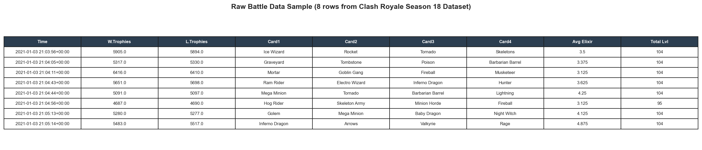

**Screenshot 2 - Card Distribution**: A bar chart showing the top 20 most popular cards by appearance frequency, color-coded by rarity (Common=gray, Rare=blue, Epic=purple, Legendary=orange). The Log and Zap dominate at ~57% appearance rate.

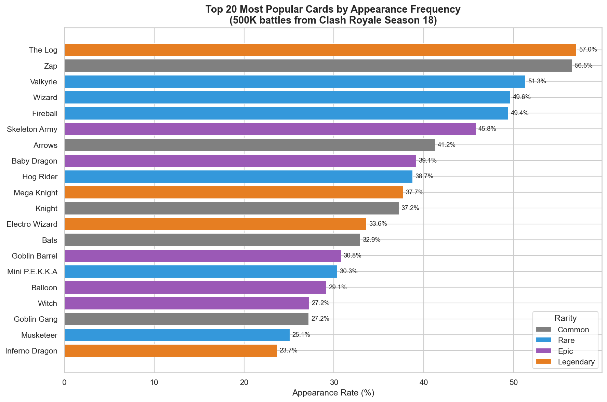

**Screenshot 3 - Win Rate by Rarity**: A box plot with four boxes (one per rarity tier) showing the distribution of per-card win rates. Legendary cards show a tighter, slightly higher win rate distribution compared to other rarities.

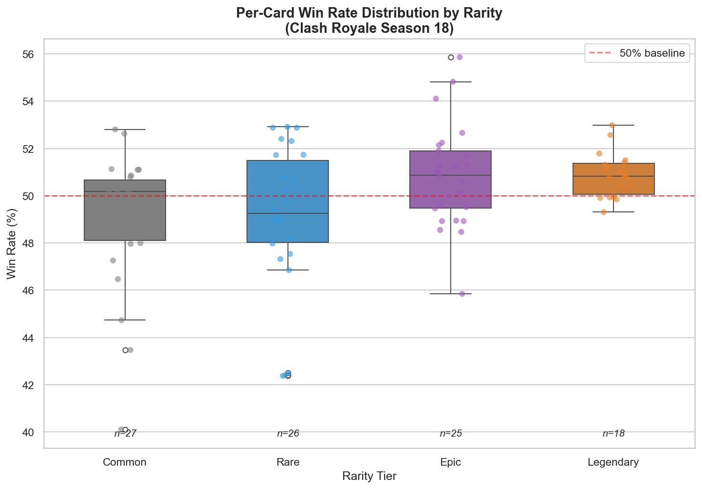

**Screenshot 4 - Deck Cost Histogram**: A histogram of average deck elixir costs overlaid with win rate trend lines. Deck costs peak around 3.5–4.0 elixir, and mid-cost decks (~3.0 elixir) show the highest win rates.

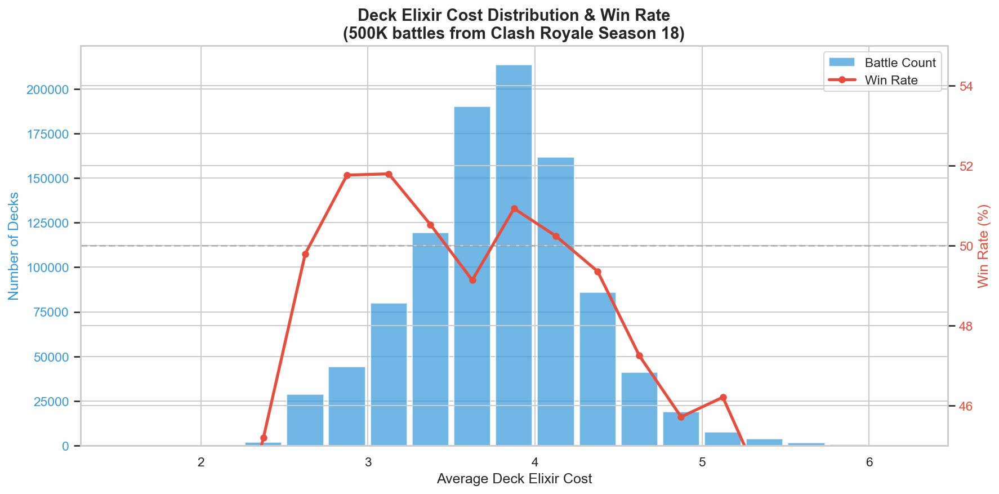

**Screenshot 5 - Card Level Distribution**: A histogram showing the distribution of average card levels across all players. The distribution is heavily right-skewed with a median of 12.75, indicating most players in this trophy range are near max level (13).

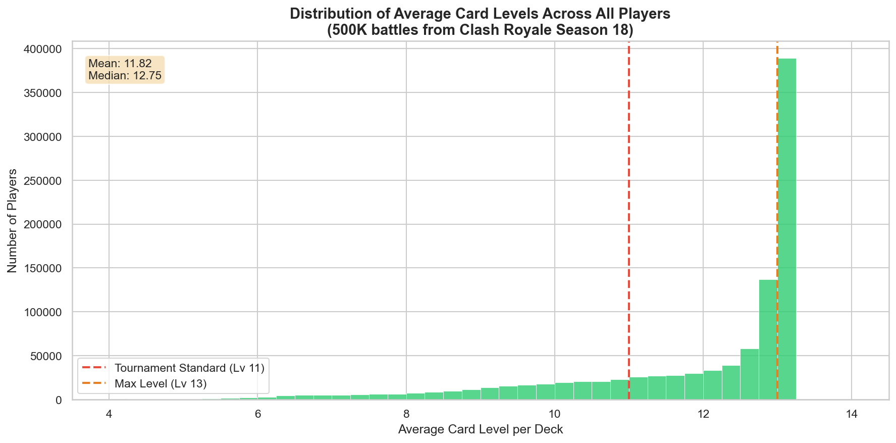

**Screenshot 6 - Counter Matrix Heatmap Preview**: A 10×10 heatmap showing win rates for the top 10 most popular cards against each other, with color intensity representing counter strength. Notable: The Log dominates Skeleton Army (54.4% WR), while Wizard struggles against Zap (45.7% WR).

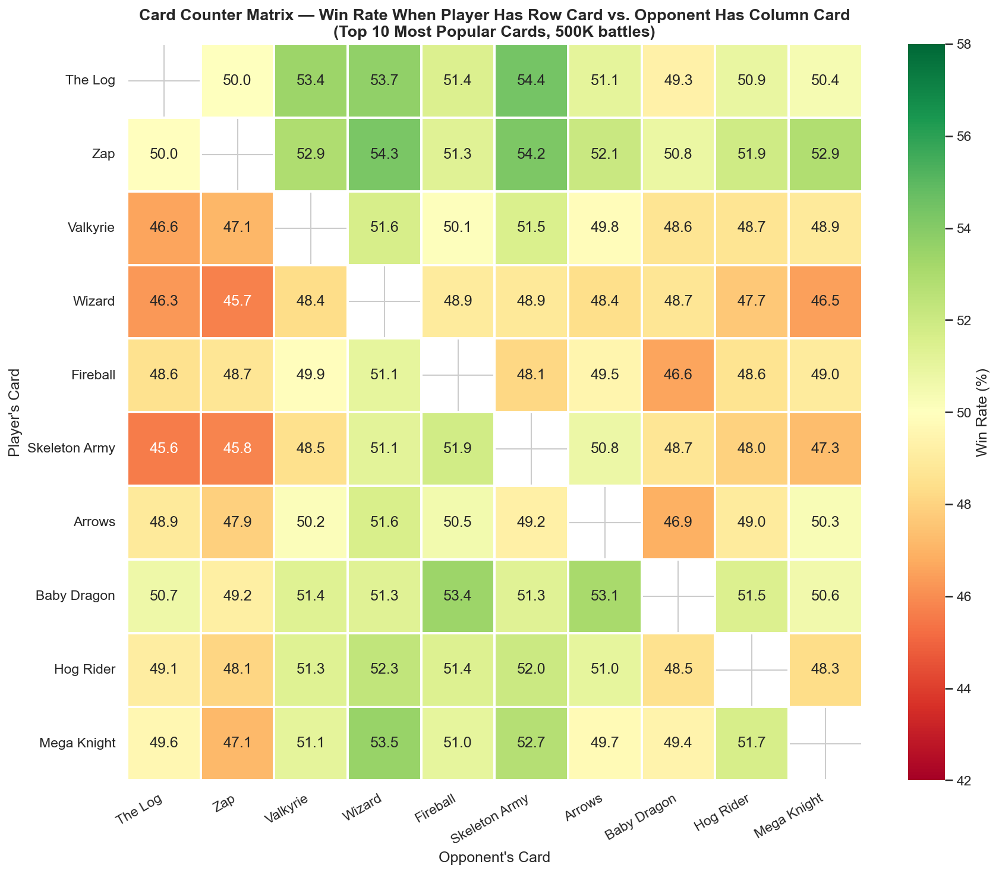

---

### System Design

Our Streamlit dashboard will provide an interactive, multi-view interface for exploring Clash Royale's competitive meta. The design prioritizes **ease of navigation**, **statistical rigor**, and **actionable insights** for both casual players and data scientists.

#### Dashboard Structure

The system will consist of five main views accessible via a sidebar navigation menu:

1. **Overview & Meta Summary**
2. **Card Counter Analysis**
3. **Rarity & Pay-to-Win Investigation**
4. **Card Level Impact Analysis**
5. **Deck Cost Optimizer**

Each view will feature interactive visualizations with linked selections, filters, and statistical overlays.

---

#### View 1: Overview & Meta Summary

**Purpose**: Provide a high-level snapshot of the competitive landscape.

**Components**:
- **KPI Cards** (top of page): Display total battles analyzed (37.9M), number of unique cards (100+), date range (Dec 3-20, 2020), and average trophies per player
- **Top 10 Most Popular Cards** (bar chart): Horizontal bars showing appearance rates, color-coded by rarity
- **Top 10 Highest Win Rate Cards** (bar chart): Similar layout but sorted by win rate, with error bars showing 95% confidence intervals
- **Deck Cost Distribution** (histogram): X-axis = average deck cost (2.0-5.0 elixir), Y-axis = battle count, overlaid with smoothed win rate curve (right Y-axis)
- **Level Advantage Impact** (scatter plot): X-axis = average card level difference (winner - loser), Y-axis = win probability, showing the correlation between level advantage and match outcomes

**Interactions**:
- Clicking a card in any chart filters all other views to focus on that card
- Hovering shows tooltips with detailed stats (win rate, appearance count, rarity, cost)

**Sketch**:


---

#### View 2: Card Counter Analysis

**Purpose**: Allow users to explore card-vs-card matchups and identify counters/synergies.

**Components**:
- **Card Selector** (dropdown or searchable autocomplete): Choose a primary card to analyze
- **Counter Matrix Heatmap**: 10×10 (or larger, scrollable) grid showing the selected card vs. all others. Cells colored by win rate differential (green = favorable matchup, red = hard counter). Statistical significance marked with asterisks (*, **, ***).
- **Top 5 Counters & Top 5 Weaknesses** : Display cards that beat or lose to the selected card, ranked by effect size, with win rate percentages
- **Synergy Analysis** (network graph or table): Show which cards frequently appear alongside the selected card in winning decks, with edge thickness representing synergy strength

**Interactions**:
- Selecting a card updates all visualizations to focus on that card
- Clicking a cell in the heatmap displays a detailed breakdown (sample size, confidence interval, z-score)
- Toggling filters for rarity, card type (spell/troop/building), or cost range
- Exporting the counter matrix as a CSV for external analysis

**Sketch**:


---

#### View 3: Rarity & Pay-to-Win Investigation

**Purpose**: Test whether card rarity (and thus acquisition cost) predicts dominance.

**Components**:
- **Rarity Distribution** (box plot): Four boxes (Common, Rare, Epic, Legendary) showing win rate distributions per card within each tier
- **ANOVA/Kruskal-Wallis Test Results**: Display F-statistic, p-value, and interpretation ("Rarity significantly predicts win rate, p < 0.001")
- **Scatter Plot**: X-axis = card cost (to upgrade to max level), Y-axis = win rate, color = rarity. Includes regression line and R² value
- **Top Legendary vs. Top Common Cards** (side by side comparison): Show the best performing legendary cards vs. the best commons to see if legendary status confers inherent advantage
- **Usage Rate vs. Win Rate Quadrant Chart**: Four quadrants (high usage/high WR, high usage/low WR, low usage/high WR, low usage/low WR) with cards plotted, revealing "meta sleepers" and "overrated" cards

**Interactions**:
- Filter by trophy range (e.g. only analyze battles above 6000 trophies) to control for skill level
- Toggle between raw win rate and "win rate vs. expected" (based on rarity-adjusted baseline)
- Click a card to see its detailed stats in a modal

**Sketch**:


---

#### View 4: Card Level Impact Analysis

**Purpose**: Quantify how card level disparities affect win probability and test pay-to-upgrade mechanics.

**Components**:
- **Level Advantage Distribution** (histogram): X-axis = card level difference (winner avg level - loser avg level), ranging from -5 to +5. Y-axis = frequency. Shows the distribution of level disparities across all battles
- **Win Probability Curve** (line chart): X-axis = player's level advantage, Y-axis = win probability. Displays a logistic regression curve showing how win rate increases with level advantage, with confidence bands
- **Fair vs. Unfair Matches** (pie chart): Categorizes battles into "fair" (level difference ≤ 0.5), "slight advantage" (0.5-1.5), and "major advantage" (>1.5), showing what percentage of matches have significant level imbalances
- **Level Disparity by Trophy Range** (grouped bar chart): Shows average level differences across different trophy brackets (0-4000, 4000-5000, 5000-6000, 6000+), testing whether higher-skilled players face more balanced matchmaking
- **Cost to Win Analysis** (regression plot): X-axis = estimated upgrade cost (in USD or time) based on average deck level, Y-axis = win rate. Includes a dollar-to-winrate conversion that estimates the monetary ROI of upgrading cards

**Interactions**:
- Filter by trophy range to isolate specific skill tiers
- Toggle between "all cards" vs. specific rarity tiers to see if legendary upgrades have outsized impact
- Click data points to see example battles with that level configuration
- Slider to adjust level advantage threshold for "fair match" definition

**Sketch**:


---

#### View 5: Deck Cost Optimizer

**Purpose**: Help users build decks by exploring the cost performance relationship.

**Components**:
- **Deck Builder Interface**: Drag and drop or click to add card selector. Shows current deck (8 cards), average cost, and predicted win rate based on historical data
- **Cost vs. Win Rate Curve**: Line chart showing win probability (Y-axis) vs. average deck cost (X-axis), with confidence bands. Users can see where their deck falls on this curve
- **Recommended Adjustments**: If the user's deck is suboptimal, suggest card swaps to improve balance (e.g., "Replace Knight with Ice Golem to reduce cost while maintaining win rate")
- **Archetype Classifier**: Use clustering or decision trees to classify the user's deck into an archetype (e.g., "Beatdown", "Cycle", "Control") and show average stats

**Interactions**:
- Users build a deck by selecting 8 cards, then see real time updates to predicted win rate and cost
- Toggle between "optimize for cost" (cheapest competitive deck) vs. "optimize for win rate" (highest WR deck)
- Compare the user's deck against top performing decks with similar cost profiles

**Sketch**:


---

#### Technical Implementation

**Frontend**: Streamlit with Plotly for interactive charts, Matplotlib/Seaborn for static plots, and custom CSS for styling

**Backend**: Pre-computed aggregations stored in Parquet files, loaded at startup. User interactions trigger fast queries against indexed data structures

**Statistical Overlays**: Confidence intervals, p-values, and effect sizes will be displayed via tooltips and annotation layers

**Export Options**: Users can download filtered datasets, counter matrices, or chart images via Streamlit's download buttons

---

#### Interaction Summary

| View                  | Primary Interactions                                                                 |
|-----------------------|--------------------------------------------------------------------------------------|
| Overview              | Click cards to filter, hover for details, adjust date/trophy filters                |
| Card Counters         | Select card, explore heatmap, toggle rarity/cost filters, export matrix             |
| Rarity Analysis       | Filter by trophy range, click cards for details, compare rarity tiers               |
| Level Impact          | Filter by trophy/rarity, adjust fairness threshold, view cost vs win estimates      |
| Deck Optimizer        | Drag and drop deck builder, real-time win rate prediction, comparison with top decks |

All views will support cross-filtering: selecting a card in one view highlights it in all others, enabling fluid exploration of the meta.

---

### Conclusion

This dashboard transforms 37.9 million Clash Royale battles into actionable insights about card balance, strategic counters, pay-to-win dynamics, and the impact of card progression systems. By combining statistical testing with intuitive visualizations, we empower both casual players and data scientists to understand and optimize their gameplay in a transparent, evidence-based manner. The card level analysis in particular provides unprecedented insight into how much competitive advantage can be purchased through card upgrades versus earned through skill and strategy.

