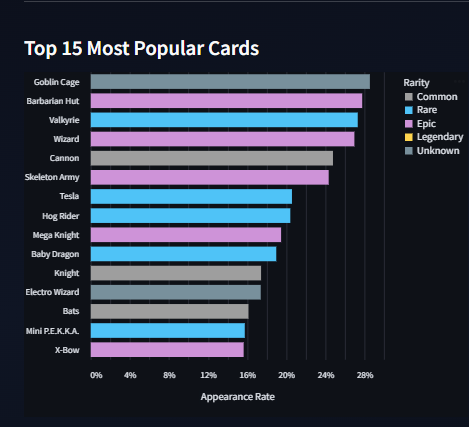
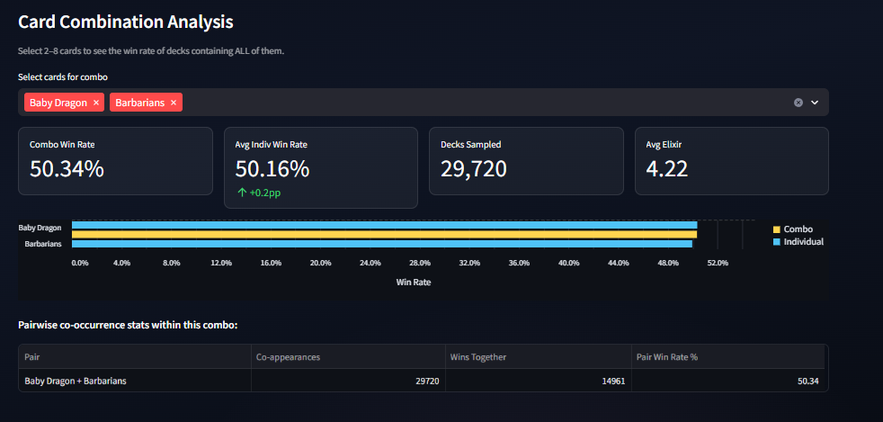
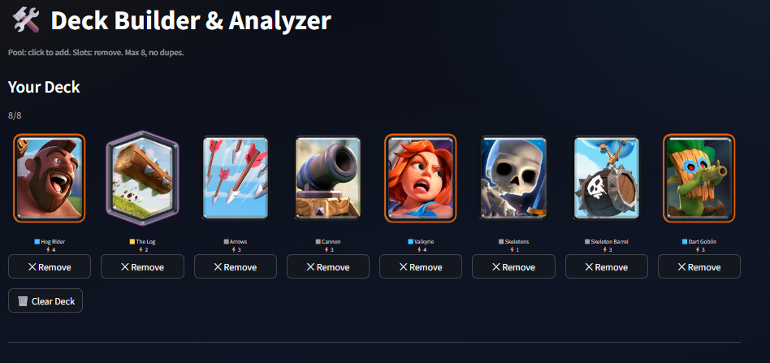
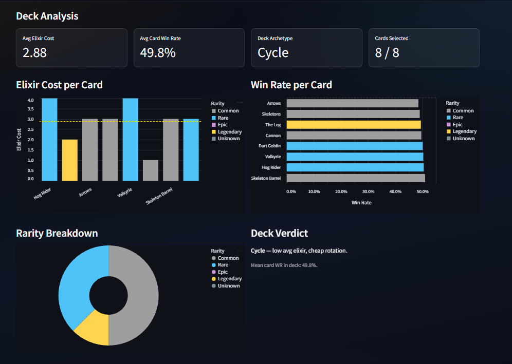
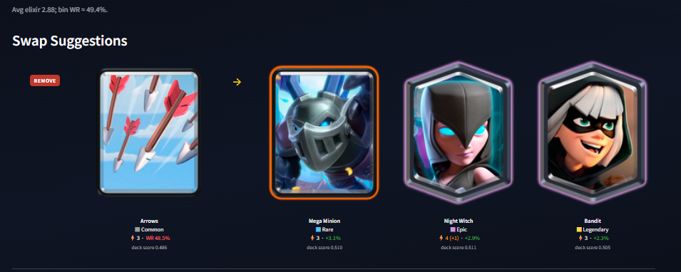
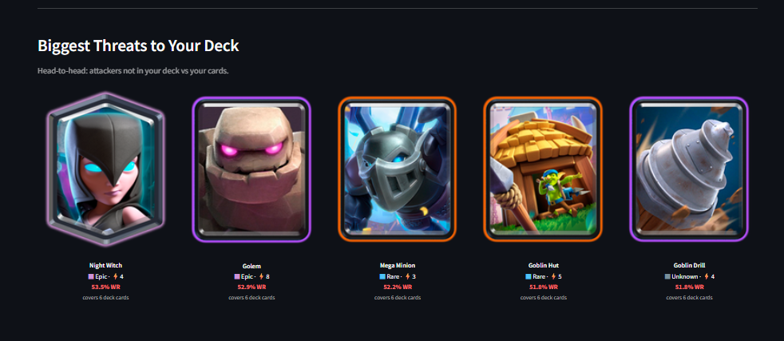

# Season 18 Clash Royale Deck Builder: A Data-Driven Approach to Deck Construction and Meta Analysis

**Nihar Atri, Hou Kin Wan, Andrew Zhang, Natan Zmudzinski**
Carnegie Mellon University · Interactive Data Science (Spring 2026)

---

## 1. Introduction

Clash Royale is a real-time strategy mobile game combining elements of collectible card games, tower defense, and multiplayer online battle arena games. It is one of the most popular mobile games in the world with over 1 million daily users [1]. In Clash Royale, two players are matched against each other with the objective of destroying each other's towers in 3 minutes of regular gameplay. Each player creates an 8-card deck before the match by selecting 8 cards from the 100+ cards available.

Each card is quite distinct. Cards differ in rarity, troop type, elixir cost, hitpoints, damage output, damage type, and special abilities. This variety combinatorially creates over a billion possible deck configurations, producing an enormous space of offensive and defensive interactions. Some cards work very well together within the same deck; some deck constructs counter other decks so effectively that the conclusion to the match is almost predictable. While player skill contributes significantly to match outcomes, the synergies between cards within a deck cannot be discounted.

We use the Season 18 Ladder Dataset published on Kaggle, which consists of 37.9 million distinct match records, to discover what synergies and counters exist in Clash Royale. Additionally, we analyze which cards are popular and whether there is a correlation between popularity and effectiveness. Lastly, we analyze whether average deck elixir cost affects win rate. We combine these three analytical approaches to create the **Season 18 Clash Royale Deck Builder**, an interactive tool that allows a player to build a deck and receive comprehensive analytics including deck archetype, synergy-aware swap suggestions, and possible threats. Ultimately, the analysis and Deck Builder give players crucial insight without requiring them to test new deck configurations in an actual match where a loss risks rank on the leaderboard.

---

## 2. Related Work

Data-driven approaches to competitive game analysis have grown substantially alongside the emergence of large-scale game telemetry datasets. Eggert et al. [2] demonstrated that role and position statistics derived from match logs can reliably predict player performance in League of Legends, establishing a methodological precedent for outcome prediction from deck or team composition data. Similarly, Semenov et al. [3] showed that hero draft selections in Dota 2 are sufficient to predict match outcomes with accuracy well above chance, suggesting that strategic composition choices — analogous to deck construction in Clash Royale — are a primary driver of competitive results.

Within the domain of collectible card games specifically, Eger and Chacón [4] showed that a Hearthstone opponent's deck archetype can be inferred from as few as the first turn's actions using machine learning classifiers trained on match logs — demonstrating that aggregate card-usage patterns contain strong strategic signals. Their work motivates our use of population-level win-rate data as a proxy for deck archetype strength. Chen et al. [5] proposed Q-DeckRec, a reinforcement-learning-based deck recommendation system for collectible card games, framing deck construction as a sequential decision problem. Their finding that a relatively small set of high-synergy card combinations dominates win outcomes is a finding our own pair co-occurrence analysis corroborates directly in the Clash Royale context.

Our approach differs from prior work in two key ways. First, rather than training a predictive model, we expose the underlying win-rate statistics directly to the user, making every recommendation transparent and falsifiable. Second, we introduce a synergy scoring framework grounded in empirical co-occurrence data — the pairwise win rate of card combinations drawn from millions of real matches — rather than learned embeddings or hand-crafted heuristics. This grounds the deck builder in the actual competitive experience of the full player population rather than the habits of elite players or simulated play.

---

## 3. Methods

Our methodology consists of a preprocessing pipeline that computes several statistical structures from the raw battle data, and a Streamlit-based front-end that queries those structures interactively.

**Data Loading and Sampling.** Due to the scale of the dataset (37.9 million records), we load all CSV files and apply a 30% random sample, yielding approximately 11 million battles. This reduces computation time while preserving statistical representativeness across the full season.

**Per-Card Win Rate and Appearance Rate.** For each card, we compute a win rate as the number of appearances in winning decks divided by total appearances across all decks. Appearance rate is normalized by total battles multiplied by two, since each battle contains two decks. These metrics form the backbone of the Card Stats and Overview pages, and inform the individual win rate component of the Deck Builder's synergy scoring.

**Deck Cost vs. Win Rate.** We bin each deck's average elixir cost into 0.25-wide intervals ranging from 1.5 to 6.0 and compute the win rate per bin. This analysis powers the Deck Cost Analysis page and the meta win rate curve displayed in the Deck Builder, which shows where a user's constructed deck falls relative to the season-wide trend.

**Card Level Advantage Analysis.** We compute the difference in average card level between the winner and loser of each battle, normalized per card, and bin it to plot win probability as a function of level advantage. This analysis investigates pay-to-win dynamics and is presented on the Card Level Impact page.

**Counter Matrix.** For the top 60 most-used cards we compute P(win | player has card A, opponent has card B) across all battles. This is done by joining winner and loser card tables on battle ID to enumerate every cross-deck card pair, then computing win rates filtered to pairs with at least 200 encounters for statistical reliability. The resulting pairwise win rate matrix directly powers the Biggest Threats feature in the Deck Builder, which identifies cards outside the user's deck that historically perform well against cards within it.

**Card Pair Co-occurrence and Synergy.** For every pair of cards co-appearing in the same deck, we compute co-appearance frequency and the win rate of decks containing both cards. Pairs with fewer than 200 appearances are excluded. This produces a synergy table used directly in the Deck Builder's swap suggestion engine.

**Deck Records for Combination Queries.** Each deck is serialized as a pipe-delimited, sorted string of card names and stored in a flat table. At query time, substring matching over this table retrieves all decks containing a given set of cards, enabling arbitrary multi-card combination win rate lookups in the Card Combination Analysis feature.

**Deck Builder Synergy Scoring.** Swap suggestions are generated by scoring each candidate card using a weighted formula: 60% of the score comes from the average pairwise win rate between the candidate and the other seven deck cards, and 40% from the candidate's individual win rate. The three deck cards with the lowest synergy scores are identified as the weakest links. Replacement candidates are ranked by net score improvement, with a small elixir-shift penalty applied to preserve deck balance, and a type-balance flag raised when removing a card would leave the deck without any spell or building.

**Archetype Classification.** We apply a rule-based classifier to label each constructed deck with one of five archetypes: Cycle, Control, Midrange, Beatdown, or Siege. Classification is based on average elixir cost and the count of each card type (troops, spells, buildings) in the deck.

---

## 4. Results

**Overview and Card Popularity.** The Overview page provides a high-level snapshot of the Season 18 meta. The top 15 most popular cards by appearance rate reveal a strong preference for cheap, versatile cards: The Log (2 elixir) and Zap (2 elixir) each appear in over 55% of all decks, while Hog Rider and Goblin Barrel anchor the most common win conditions. The popularity-vs-win-rate scatter plot surfaces a meaningful tension between these two dimensions — many of the most-played cards sit right at the 50% win rate line, suggesting that their dominance reflects strategic centrality rather than raw power.

**Card Stats and Combination Analysis.** The Card Stats page exposes per-card win rates and appearance rates with rarity and minimum-appearance filters. The most powerful feature on this page is the **Card Combination Analysis**: a user selects 2–8 cards and the system queries the deck records table to report the empirical win rate of all Season 18 decks containing that exact combination. As an illustrative example, decks containing both Hog Rider and The Log — one of the community's most-discussed core pairs — show a win rate of approximately 52.1%, meaningfully above the 50% baseline, with over 400,000 co-appearances confirming statistical reliability. The pairwise co-occurrence table beneath the summary makes it possible to decompose which pairs within a combination are driving the synergy.

**Rarity and Pay-to-Win.** The rarity analysis shows that median win rates across Common, Rare, Epic, and Legendary cards are nearly indistinguishable, all clustering within one percentage point of 50%. The win rate distribution for Legendary cards is marginally tighter — fewer outliers in both directions — but no rarity tier shows a statistically meaningful elevation. This is a striking finding in the context of a game where Legendary cards require substantially greater in-game (or real-money) investment to obtain and upgrade.

**Card Level Impact.** The level advantage analysis reveals that a one-level-per-card advantage increases win probability by approximately 3–5 percentage points. However, this effect is heavily concentrated at lower trophy ranges (below 5,000 trophies). At the 6,000+ trophy bracket, average level disparities between winners and losers drop to below 0.4 levels per card, indicating that the matchmaking system largely eliminates level imbalance among the highest-skilled players. Pay-to-win dynamics are real but bracket-specific.

**Deck Builder — Analysis, Swaps, and Threats.** The Deck Builder is the central deliverable of this project. After selecting 8 cards, a player receives their deck's average elixir cost, archetype label, per-card win rate breakdown, and placement on the meta win rate curve. The swap suggestion engine then identifies the three deck cards with the lowest synergy scores and proposes replacements ranked by how much they would improve the deck's overall synergy score, with elixir-shift and card-type warnings displayed inline.

The Biggest Threats panel completes the analysis by querying the counter matrix to identify cards not in the user's deck that historically win against the specific cards the user has chosen. This gives players a targeted list of what to watch for and prepare to defend against.

---

## 5. Discussion

This analysis of Clash Royale Season 18 uses a distinctive metric to evaluate deck quality: empirical win rate derived from millions of real matches, rather than imitation of top-player patterns. The reasoning is straightforward: the objective of every match is to win, so a deck builder that directly optimizes for win rate should produce more broadly applicable recommendations than one that mirrors the habits of a small elite.

In practice, this means the Deck Builder can surface non-obvious card combinations that perform well across the full player population but may never appear in a professional player's deck. It also means that recommendations are transparent and falsifiable: every swap suggestion and threat alert traces back to a concrete statistical computation that users can interrogate on the Card Stats and Card Combination pages.

A recurring complaint in the Clash Royale community is that decks converge toward a small number of dominant configurations as a season progresses, making the latter half of each season feel repetitive. A deck builder grounded in win rate rather than player trends has the potential to resist this convergence, surfacing viable alternatives that the community may not have collectively discovered yet. We hope this tool contributes positively to deck diversity and keeps competition fresh throughout the season.

The rarity analysis adds a second layer to this picture. Players often invest significant resources chasing Legendary cards under the assumption that rarity correlates with power, but the data shows no meaningful win-rate gap between rarity tiers at the population level. The real competitive levers are synergy and elixir balance — variables that are fully within a player's control regardless of their card collection. Making this visible is one of the more practically useful things the tool does.

The counter matrix tells a similar story about received wisdom in the other direction. Many matchups that the Clash Royale community treats as near-certain losses turn out to be only modest disadvantages in the data — a few percentage points rather than the decisive edges that forum discussions imply. Players who understand this are less likely to concede winnable games or abandon otherwise strong deck configurations based on a single bad matchup experience.

---

## 6. Future Work

his project was built using Season 18 data from December 2020. The most immediate improvement would be updating the pipeline to ingest data from the current season, ensuring that recommendations remain relevant to today's card pool and meta.

Beyond data freshness, the swap recommendation engine could be enriched with domain knowledge. The current scoring formula considers only pairwise win rate and elixir cost, but does not account for a deck's win condition (the primary card or combination a player builds around to destroy towers) or the distribution of card types. Penalizing swaps that disrupt the win condition or create a type imbalance (for example, leaving a deck with no spell to handle swarms) could meaningfully improve recommendation quality.

Finally, expanding the counter matrix beyond the top 60 cards and incorporating trophy-range segmentation would allow the Deck Builder to tailor suggestions to a player's specific skill bracket, since the optimal deck at 4,000 trophies may differ substantially from the optimal deck at 7,000.

---

## References

[1] ActivePlayer.io. *Clash Royale Live Player Count and Statistics.* https://activeplayer.io/clash-royale/

[2] Eggert, C., Herrlich, M., Smeddinck, J., & Malaka, R. (2015). Classification of Player Roles in the Team-Based Multi-player Game Dota 2. *Entertainment Computing — ICEC 2015*, Lecture Notes in Computer Science, vol 9353. Springer, Cham. https://link.springer.com/chapter/10.1007/978-3-319-24589-8_9

[3] Semenov, A., Romov, P., Korolev, S., Yashkov, D., & Neklyudov, K. (2016). Performance of Machine Learning Algorithms in Predicting Game Outcome from Drafts in Dota 2. *Proceedings of the International Conference on Data Mining Workshops (ICDMW)*, 589–595. https://www.researchgate.net/publication/313010005_Performance_of_Machine_Learning_Algorithms_in_Predicting_Game_Outcome_from_Drafts_in_Dota_2

[4] Eger, M., & Chacón, P. S. (2020). Deck Archetype Prediction in Hearthstone. *Proceedings of the 15th International Conference on the Foundations of Digital Games (FDG 2020)*. ACM. https://dl.acm.org/doi/abs/10.1145/3402942.3402959

[5] Chen, Z., Amato, C., Nguyen, T.-H. D., Cooper, S., Sun, Y., & El-Nasr, M. S. (2018). Q-DeckRec: A Fast Deck Recommendation System for Collectible Card Games. *2018 IEEE Conference on Computational Intelligence and Games (CIG)*, 1–8. https://ieeexplore.ieee.org/document/8490446/

[6] Kaggle. *Clash Royale Season 18 Ladder Dataset.* https://www.kaggle.com/datasets/bwandowando/clash-royale-season-18-dec-0320-dataset

---
